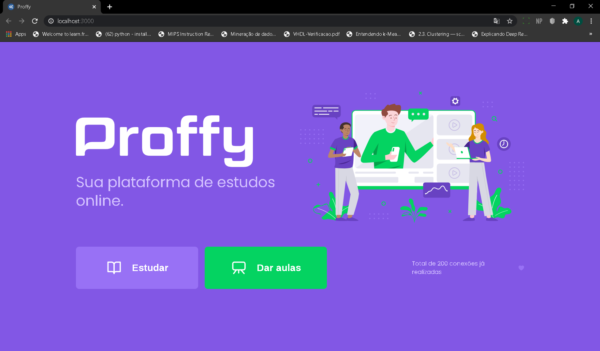
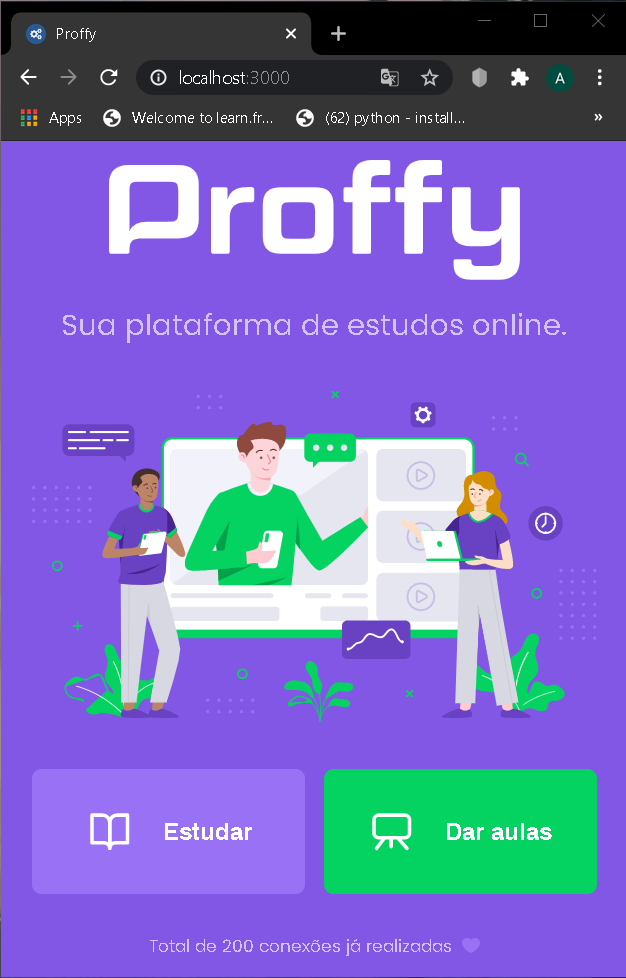
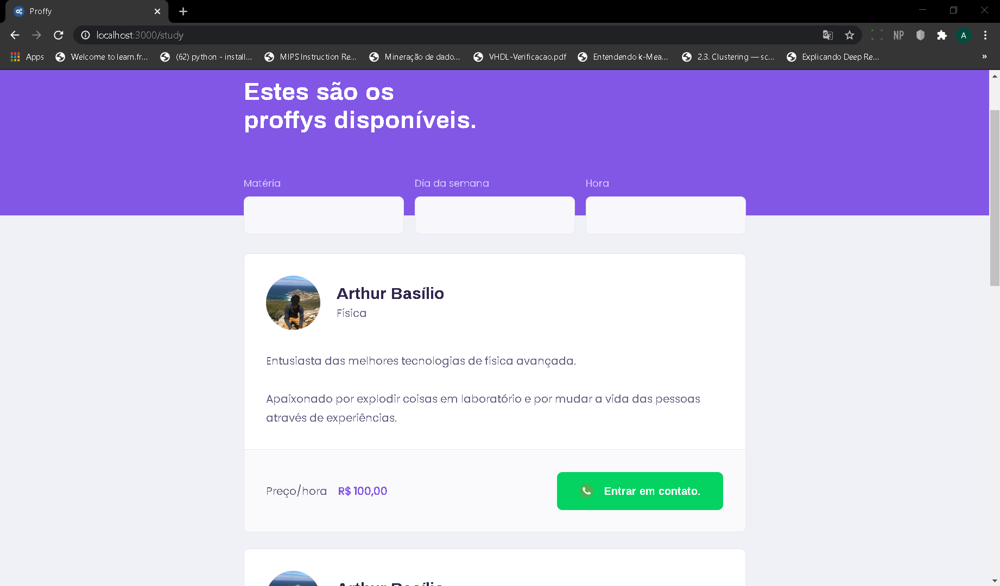
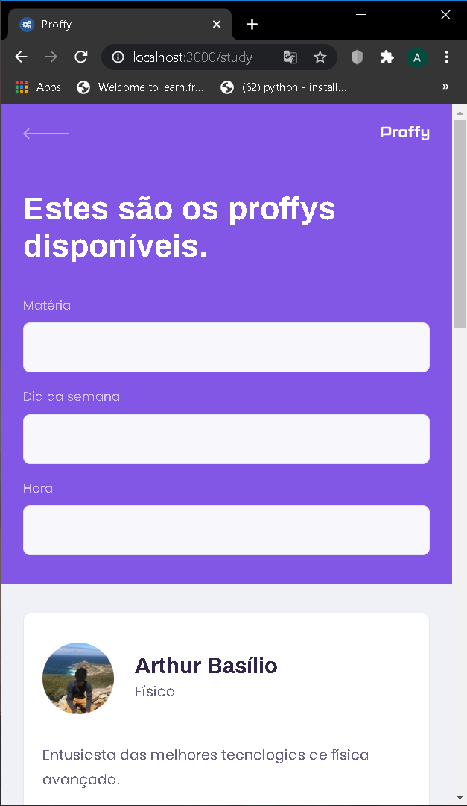
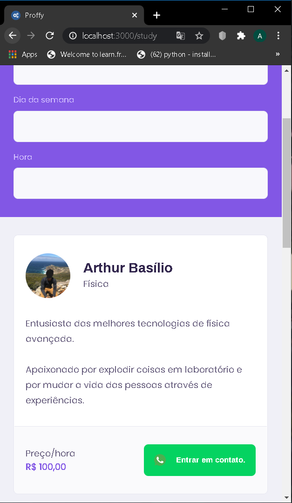
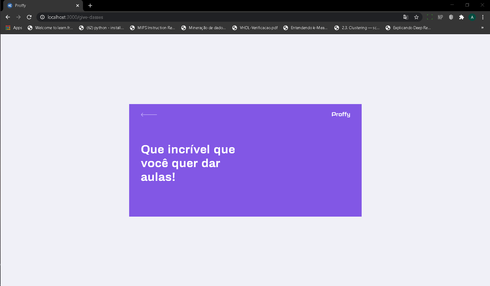
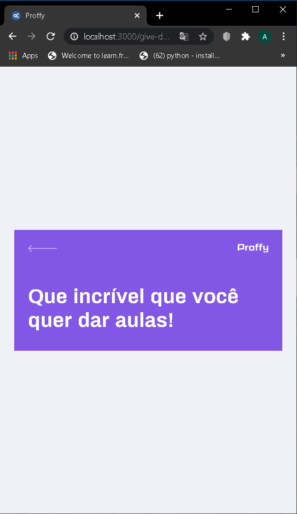

# :rocket: Next-Level-Week 2 :beginner:

O repositório tem como objetivo registrar o conhecimento obtido durante toda a semana. Todos os códigos envolvidos estão comentados de maneira a se extrair o máximo de informação possível das aulas.

# :computer: Estado atual do projeto

## Home_web
### Desktop

### Smartphone

## Estudar_web
### Desktop

### Smartphone

## Dar aula_web
### Desktop

### Smartphone

