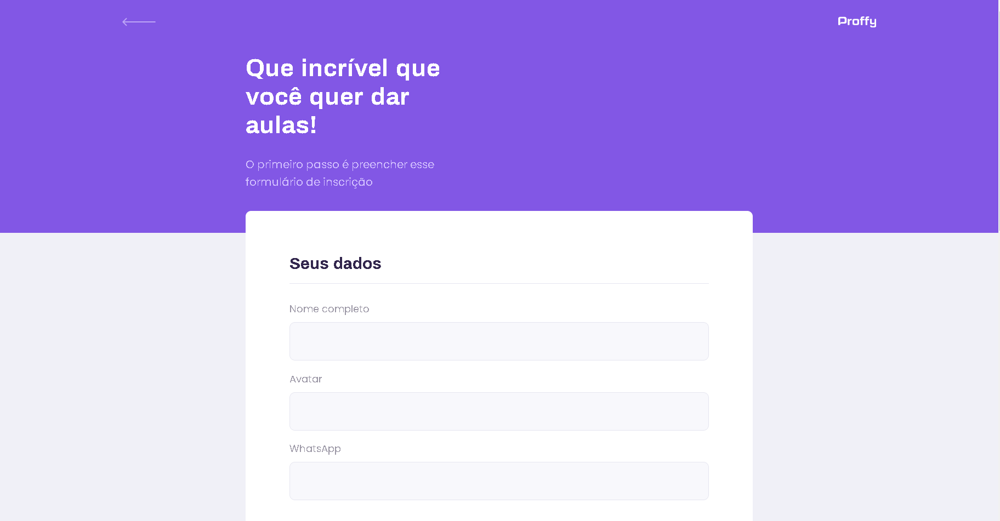
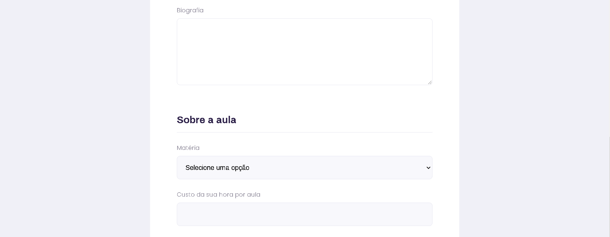
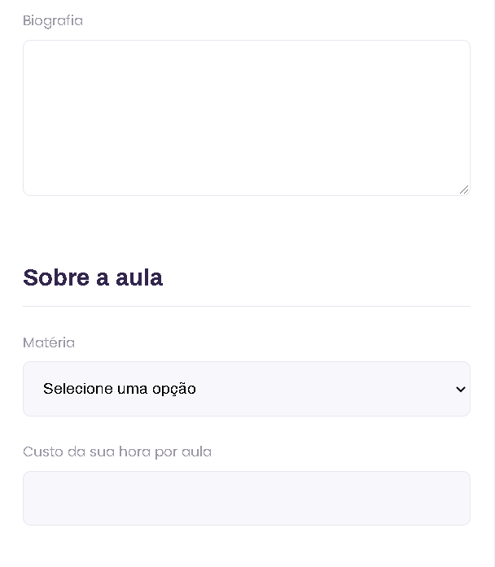
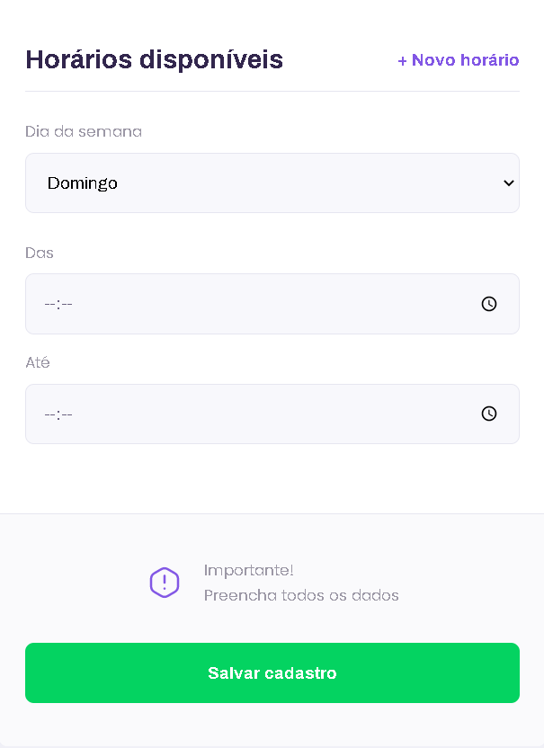
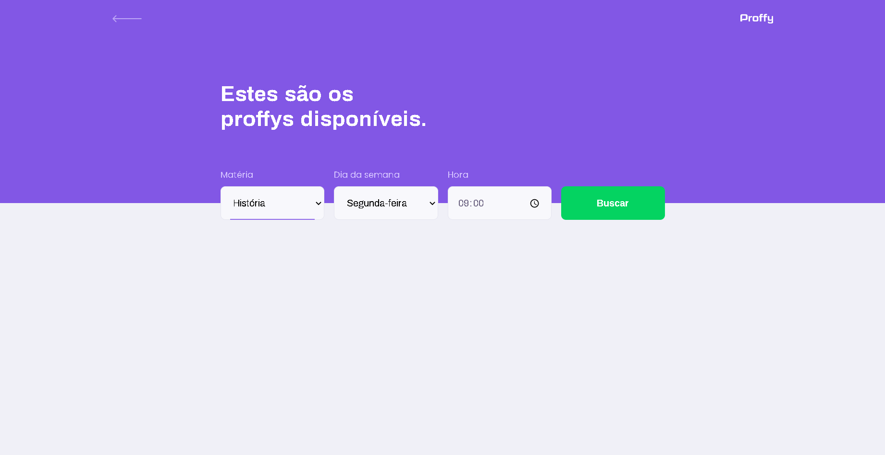
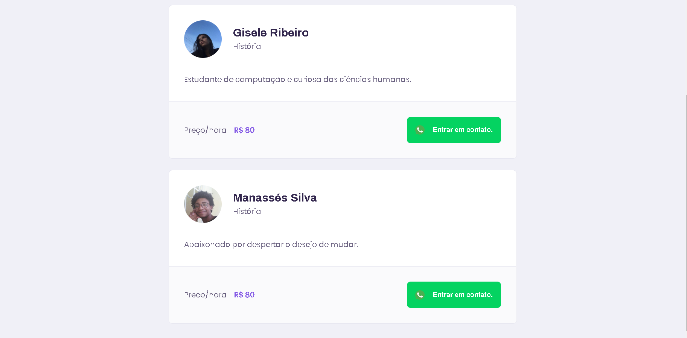
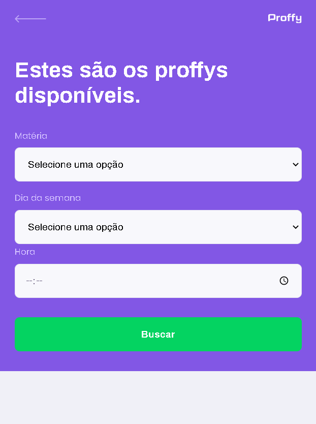
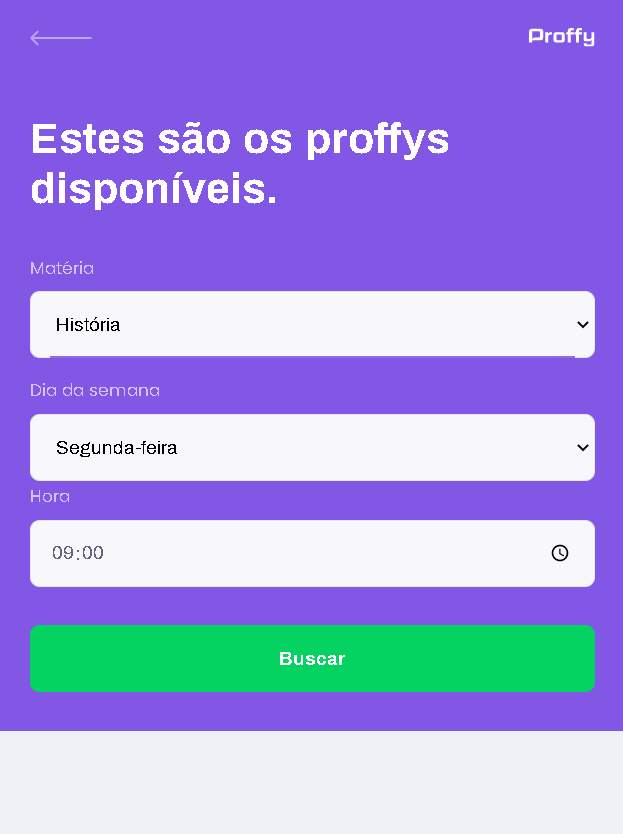

# :woman_teacher::man_teacher: Proffy - Web

Implementação do Front-end do projeto desenvolvido na Next Level Week #2 da Rocketseat. O projeto se trata da construção de uma plataforma web de estudos online, onde o usuário pode se cadastrar como professor ou aluno e buscar pelos professores disponíveis em um determinado dia da semana e em um determinado horário.

O repositório tem como objetivo registrar o conhecimento obtido durante toda a semana. Todos os códigos envolvidos estão comentados de maneira a se extrair o máximo de informação possível das aulas.

# :computer: Pages

## Landing
### 1440x900

### 375x667

## TeacherForm
### 1440x900

### 375x667

## TeacherList
### 1440x900

### 375x667

